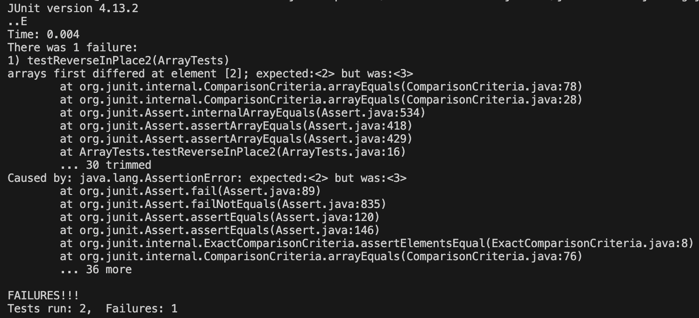
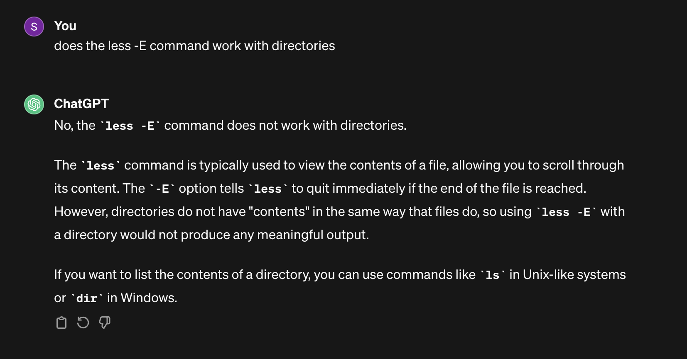

# Lab Report 3
---
## ReverseInPlace Bug
### Failure-Inducing Output
```
public void testReverseInPlace2(){
    int[] input2 = {1,2,3,4};
    ArrayExamples.buggyReverseInPlace(input2);
    assertArrayEquals(new int[]{4,3,2,1}, input2);
}
```
### Non Failure-Inducing Output
```
public void testReverseInPlace1() {
    int[] input1 = { 3 };
    ArrayExamples.buggyReverseInPlace(input1);
    assertArrayEquals(new int[]{ 3 }, input1);
}
```
### Symptom


### Code Before Fix
```
for(int i = 0; i < arr.length; i += 1) {
    arr[i] = arr[arr.length - i - 1];
}
```
### Code After Fix
```
for(int i = 0; i < arr.length / 2; i += 1) {
      int temp = arr[i];
      arr[i] = arr[arr.length - i - 1];
      arr[arr.length - i - 1] = temp;
}
```
The fix saves the data that is being replaced by the for loop. Since the data gets saved, it can now be used to replace the previous elements when reversing. 

## The `less` command:
### `-E` option: 
#### Command:
`less -E base-pair.txt`

#### Output:
```
biomed/1471-2091-3-4.txt
biomed/1471-2105-2-8.txt
biomed/1471-2105-2-9.txt
biomed/1471-2105-3-18.txt
biomed/1471-2105-3-2.txt
biomed/1471-2105-3-24.txt
biomed/1471-2105-4-27.txt
biomed/1471-2121-1-2.txt
biomed/1471-2121-3-10.txt
biomed/1471-213X-1-4.txt
biomed/1471-2156-2-17.txt
biomed/1471-2156-2-3.txt
biomed/1471-2156-2-7.txt
biomed/1471-2156-3-16.txt
biomed/1471-2156-3-4.txt
biomed/1471-2164-2-1.txt
biomed/1471-2164-2-4.txt
biomed/1471-2164-2-7.txt
biomed/1471-2164-3-13.txt
biomed/1471-2164-3-31.txt
biomed/1471-2164-3-35.txt
biomed/1471-2164-3-6.txt
biomed/1471-2164-3-7.txt
...
```
The `less` command prints the contents of the file that fit to the size of the terminal, and you can scroll down to access the rest of the contents after it is truncated. It is useful because the output gets truncated, so you don't have to read outputs of large files.

[Source](https://eng.libretexts.org/Bookshelves/Computer_Science/Operating_Systems/Linux_-_The_Penguin_Marches_On_(McClanahan)/05%3A_File_and_Directory_Management/3.06%3A_Working_with_Files_and_Directories/3.06.02%3A_Working_with_Files_and_Directories_-_less-more_Command)

#### Command:
`less -E 911report/`

#### Output:
`911report is not a directory`
The `less` command only works with files, and since `911report` is a directory, the command won't work.
Source: ChatGPT - used to verify output


### `-f` option:
#### Command:
`less -f biomed-sizes.txt`

#### Output:
```
432    3380   24112 biomed/1468-6708-3-1.txt
533    3630   29585 biomed/1468-6708-3-10.txt
296    2166   16882 biomed/1468-6708-3-3.txt
547    4301   31378 biomed/1468-6708-3-4.txt
317    2312   18114 biomed/1468-6708-3-7.txt
411    3181   24028 biomed/1471-2091-2-10.txt
615    4684   35103 biomed/1471-2091-2-11.txt
515    3287   24851 biomed/1471-2091-2-12.txt
564    3550   27970 biomed/1471-2091-2-13.txt
339    2496   18716 biomed/1471-2091-2-16.txt
826    5832   45414 biomed/1471-2091-2-5.txt
501    3167   25458 biomed/1471-2091-2-7.txt
481    3637   25298 biomed/1471-2091-2-9.txt
537    4002   29139 biomed/1471-2091-3-13.txt
932    7125   54849 biomed/1471-2091-3-14.txt
673    4858   34209 biomed/1471-2091-3-15.txt
702    5011   35953 biomed/1471-2091-3-16.txt
642    4253   29469 biomed/1471-2091-3-17.txt
708    5587   40558 biomed/1471-2091-3-18.txt
755    5001   40379 biomed/1471-2091-3-22.txt
605    4616   33815 biomed/1471-2091-3-23.txt
699    4531   34168 biomed/1471-2091-3-30.txt
1063    7146   56000 biomed/1471-2091-3-31.txt
```
The `less -f` command prints the truncated output of the files to the terminal, and is useful because the `-f` option can be used to open non regular files.

[Source](https://eng.libretexts.org/Bookshelves/Computer_Science/Operating_Systems/Linux_-_The_Penguin_Marches_On_(McClanahan)/05%3A_File_and_Directory_Management/3.06%3A_Working_with_Files_and_Directories/3.06.02%3A_Working_with_Files_and_Directories_-_less-more_Command)

#### Command:
`less -f government`

#### Output:
`read error (press RETURN)`
The command cannot print the contents of the directory, even when `-f` is used. 

### `-F` option:

#### Command:
`less -F entire-file.txt`

#### Output:
```
This file's contents can fit
On one entire terminal screen

It should end the less command after
It gets printed
(base) srikar@Srikars-MacBook-Pro-2 technical %
```
The `-F` option automatically exits the window opened by `less` if the entire file can fit on the screen. This is useful, because for files with a small output, it can be shown without having to exit the window.

[Source](https://eng.libretexts.org/Bookshelves/Computer_Science/Operating_Systems/Linux_-_The_Penguin_Marches_On_(McClanahan)/05%3A_File_and_Directory_Management/3.06%3A_Working_with_Files_and_Directories/3.06.02%3A_Working_with_Files_and_Directories_-_less-more_Command)

#### Command:
`less -F biomed`

#### Output:
`biomed is a directory`
`less -F` cannot be used to open the biomed directory because it can only be used on files.

### `-p` option:

#### Command:
`less -p 2001 base-pair.txt`

#### Outuput:
```
biomed/1477-7827-1-23.txt
biomed/ar297.txt
biomed/ar409.txt
biomed/ar774.txt
biomed/bcr570.txt
biomed/bcr571.txt
biomed/bcr602.txt
biomed/bcr631.txt
biomed/gb-2000-1-1-research002.txt
biomed/gb-2001-2-12-research0054.txt
biomed/gb-2001-2-3-research0008.txt
biomed/gb-2001-2-4-research0010.txt
biomed/gb-2001-2-4-research0011.txt
biomed/gb-2001-2-4-research0014.txt
biomed/gb-2001-2-6-research0021.txt
biomed/gb-2001-2-7-research0025.txt
biomed/gb-2001-2-8-research0027.txt
biomed/gb-2002-3-10-research0053.txt
biomed/gb-2002-3-12-research0079.txt
biomed/gb-2002-3-12-research0083.txt
biomed/gb-2002-3-6-research0029.txt
biomed/gb-2003-4-4-r24.txt
biomed/rr196.txt
```
Occurrences of `2001` are higlighted in the terminal, and this is useful because it can be used to search for certain occurrences of a keyword or phrase within the file, and exactly where in the file they occur.

[Source](https://eng.libretexts.org/Bookshelves/Computer_Science/Operating_Systems/Linux_-_The_Penguin_Marches_On_(McClanahan)/05%3A_File_and_Directory_Management/3.06%3A_Working_with_Files_and_Directories/3.06.02%3A_Working_with_Files_and_Directories_-_less-more_Command)

#### Command:
`less -p 1468 biomed`

#### Output:
`biomed is a directory`
The command doesn't work on a directory
