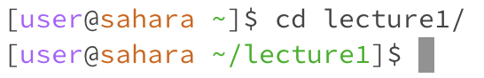

# Lab Report 1
---
Can be accessed at https://srikar-eranky.github.io/cse15l-lab-reports/lab-report-1

Here is a demonstration of the basic terminal commands `cd`, `ls`, and `cat`

## Using `cd`:
---
### Without arguments:

**Working directory:** `/home`

The cd command changes directory into another folder or directory. If no arguments are given, the computer doesn't know which directory to change into, so it won't produce any output or change the directory

### With directory as argument:

**Working directory:** `/home`

The prompt now shows up with "lecture1" before the dollar sign because the cd command changed the directory into the directory that was given as the argument, which was the lecture1 folder. 

### With file as argument:

**Working directory:** `/home`

The terminal produces this output because the cd command can only work with directories as arguments. A file is not a directory, so the computer cannot change the directory to a specific file. This is an error, because a different argument than expected was given.

## Using `ls`: 
---
### Without arguments

**Working directory:** `/home`

The terminal outputs "lecture1" because the present working directory is `/home`. The ls command shows a list of all folders and files within the present working directory, so "lecture1" will be outputted because it is the only folder in the `/home` directory.

### With directory argument:

**Working directory:** `/home/lecture1/messages/`

The terminal outputs the 4 txt files because that is the list of files present in the `lecture1/messages` directory.

### With file argument:

**Working directory:** `/home/lecture1/messages/`

The terminal just outputs the relative path to the file that was given as an argument to the ls command, because the file is the only element in that path. In this case, the argument was the path to the "es-mx.txt" file, which is why that path was printed. The "es-mx.txt" file is in the messages folder, which is in the lecture1 folder. 

## Using `cat`:
---
### Without arguments:

**Working directory:** `/home`

There is no output, because the terminal begins to read from standard input. When the cat command is given no arguments, it reads from standard input.

### With directory argument:

**Working directory:** `/home/lecture1/messages/`

The terminal produces this output because the cat command is meant for concatenating files or printing out the contents of a file. When the cat command is given a directory, it won't know what to concatenate or print, so it produces the error message. This is an error because a different argument than expected was given.

### With file argument:

**Working directory:** `/home/lecture1/messages/`

The terminal prints the contents of the file that was referred to by the path given as the argument. In this case, the path refers to the en-us.txt file, which has contents "Hello World!", which is why that is printed. 
