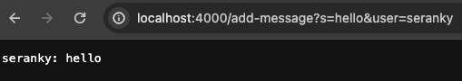
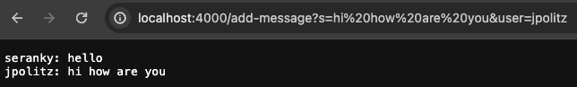
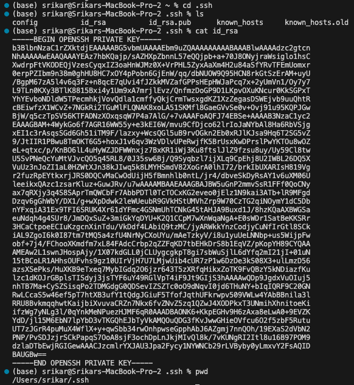
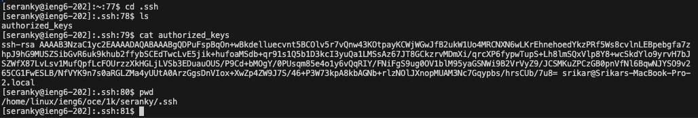
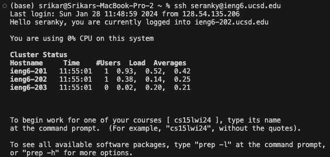

# Lab Report 3

## ChatServer Code:
---
```
import java.io.IOException;
import java.net.URI;
import java.util.ArrayList;

class Handler implements URLHandler {
    ArrayList<String> arr = new ArrayList<String>();

    public String handleRequest(URI url) {
        String path = url.getPath();
        String query = url.getQuery();
        String[] params = query.split("&");
        if(path.equals("/add-message")){
            String[] messageQuery = params[0].split("=");
            String[] userQuery = params[1].split("=");
            String user = "";
            String message = "";
            if(messageQuery[0].equals("s")){
                message = messageQuery[1];
            }
            if(userQuery[0].equals("user")){
                user = userQuery[1];
            }
            String output = user + ": " + message + "\n";
            arr.add(output);
            String finalStr = "";
            for(String s : arr){
                finalStr += s;
            }
            return finalStr;
        }
        return "Path does not exist";
    }
}
```
## Part 1 - The Server:
---

### One message added:


When running the server, the `handleRequest()` method is called. This method takes the url as an argument, and parses the url so that it can get the message and the user. It then prints out the message and the user in the format `<user>: <message>`. There is one field in the class - an ArrayList of Strings. This keeps track of all the messages that have been added, and when the `/add-message` path is called, the ArrayList gets updated with the message that was added. Iniitally the value is `null`, but once the method is called, the value of the message that was added is appeneded to the ArrayList. In this case, the value of the ArrayList is `{"seranky: hello"}`. 

### Multiple messages added:


When running the server, the `handleRequest()` method is called. This method takes a URI object representing the url as the argument. There is one field in the class - an ArrayList of Strings. This keeps track of all the messages that have been added, and when the `/add-message` path is called, the ArrayList gets updated with the message that was added. Iniitally the value is `null`, but once the method is called, the value of the message that was added is appeneded to the ArrayList. In this case, the value of the ArrayList is `{"seranky: hello", "jpolitz: hi how are you"}`, after the program is executed.

## Part 2 - Private and Public Keys
---

### Private Key


The private key on my laptop is stored in the absolute path `/Users/srikar/.ssh/id_rsa`

### Public Key


The public key in the ieng6 directory is stored in the absolute path `/home/linux/ieng6/oce/1k/seranky/.ssh/authorized_keys`

### SSH Login Without Password


### Part 3 - What Was Learned:
I learned how to create an ssh key, make a new directory for the key, and copy the file contents into a file in that directory. I learned how to use the `mkdir` and `scp` commands on the terminal.
