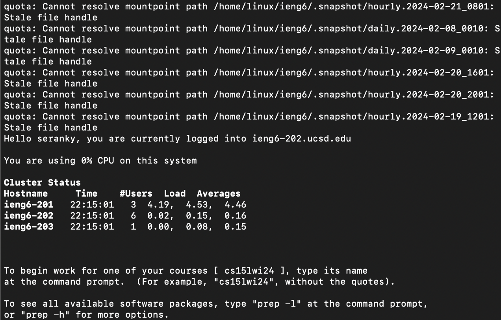
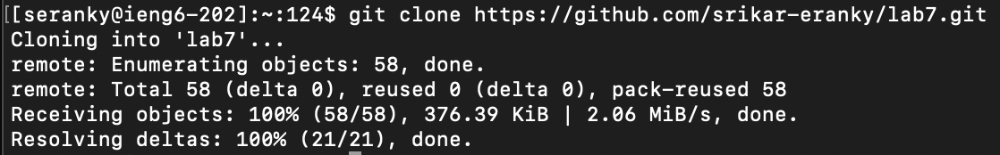
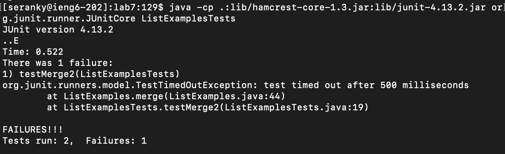
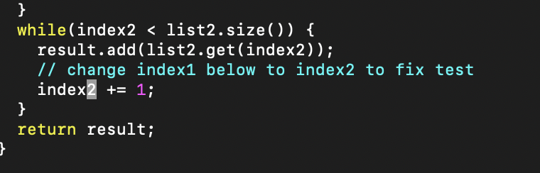
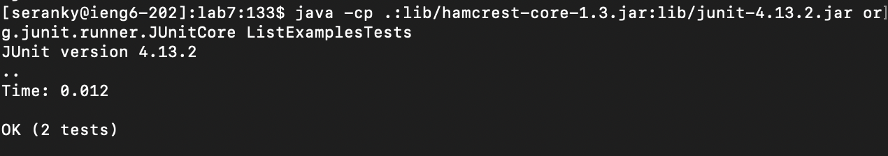
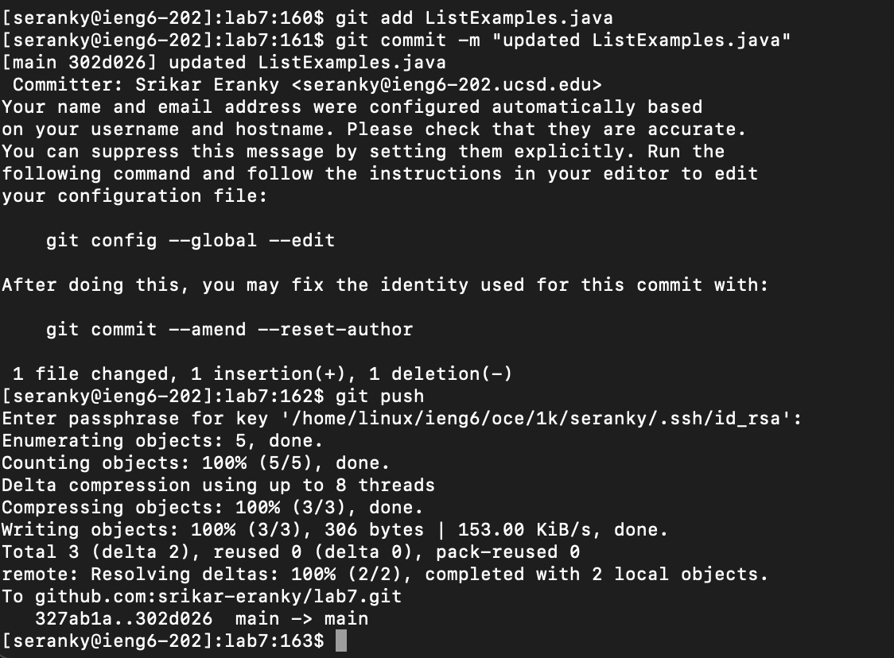

# Lab Report 4
---

This lab will focus on different keyboard shortcuts in terminal, and using those to edit a file in vim.

## Step 4:

Keys pressed: `ssh seranky@ieng6.ucsd.edu<enter>`. This was used to ssh into the ieng6 server with my school account. 

## Step 5:

Keys pressed: `git clone https://github.com/srikar-eranky/lab7.git<enter>`. This was used to clone the lab7 git repository into my ieng6 home directory.

## Step 6:

Keys pressed:  `ls<enter>, cd lab7/<enter>, ls<enter>, <up><up><up><up><up><up><up><up><up><up><up><up><up><up><up><enter>, <up><up><up><up><up><up><up><up><up><up><up><up><up><up><up><enter>`. I used `ls<enter>` to check the contents of the current directory. Then I did `cd lab7/<enter>`
to change into the `lab7/` directory. I then did `ls` again to check which files were in the directory. I did `<up>` 15 times to find the `javac -cp .:lib/hamcrest-core-1.3.jar:lib/junit-4.13.2.jar *.java`
command, and when I ran that command it compiled all `.java` files. I then did `<up>` 15 times again to find the `java -cp .:lib/hamcrest-core-1.3.jar:lib/junit-4.13.2.jar org.junit.runner.JUnitCore ListExamplesTests` command, 
which ran the tester file. 

## Step 7:

Keys pressed: `vim ListExamples.java<enter>, 42j, <down>, <right><right>, e, r2, :wq!<enter>`. I did the first command to open the ListExamples.java file in vim. `42j` was used to jump down to the
42nd line, and then I moved `<down>` and `<right>` twice to get to the first character of the line that needs to be changed. I then pressed `e` to get to the end of the word, and `r2` to replace
`1` with `2`. I then used `:wq!<enter>` to save the file and exit vim. 

## Step 8:

Keys pressed: `<up><up><up><up><enter>, <up><up><up><up><enter>`. The `javac -cp .:lib/hamcrest-core-1.3.jar:lib/junit-4.13.2.jar *.java` was 4 up in the history, so I used to up
arrows to access that command and compile the java files. I did the same with the `java -cp .:lib/hamcrest-core-1.3.jar:lib/junit-4.13.2.jar org.junit.runner.JUnitCore ListExamplesTests` command to run the tester. 

## Step 9:

Keys pressed: `git add ListExamples.java<enter>, git commit -m "updated ListExamples.java<enter>", git push`. I added the changes from `ListExamples.java` onto the staging area, then committed those changes, then pushed those changes to github.
