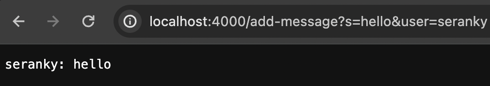
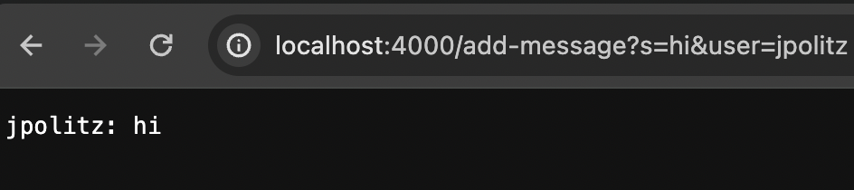
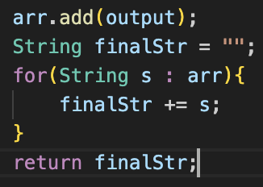
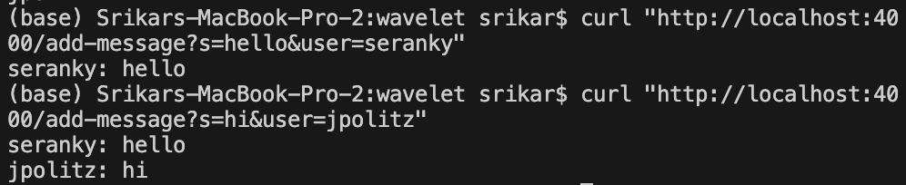

# Lab Report 5

## Part 1 - Debugging Scenario

### 1. Original Post:
Hi, I have a question about ChatServer.java - my server only prints each individual message rather than the full chat history when I query add-message in the link. How can I fix this?

First message: 

Second message:


### 2. TA Post:
Thank you for the post. Are you returning the output string by chance? Find a way to save previous strings so that you can return all of them. You can use `curl "http://localhost:<port>/add-message?s=<message>&user=<user>"` without having to run the server in your browser.

### 3. Student Fix:
I (the student) created a bash script server.sh that compiles and runs the server, which ends up triggering the bug:
```
javac ChatServer.java Server.java
echo $?
java ChatServer 4000
```
**Description of Bug:** The bug was that the previous output string was not being saved. The output string kept being changed and then returned, so it wouldn't return the rest of the chat history, only the most recent message. To fix the bug, I appended the output string to an ArrayList, then returned a final string that was the concatenation of every String in the ArrayList. 

**Student Code Fix:**


**Updated Output:**


### 4. Setup Information

**Directory/File Structure:**
```
wavelet
  - ChatServer.class
  - ChatServer.java
  - Handler.class
  - Server.class
  - Server.java
  - server.sh
  - ServerHttpHandler.class
  - URLHandler.class
```

**File Contents:**

*ChatServer.java:*
```
import java.io.IOException;
import java.net.URI;
import java.util.ArrayList;

class Handler implements URLHandler {
    // The one bit of state on the server: a number that will be manipulated by
    // various requests.
    ArrayList<String> arr = new ArrayList<String>();

    public String handleRequest(URI url) {
        String path = url.getPath();
        String query = url.getQuery();
        String[] params = query.split("&");
        if(path.equals("/add-message")){
            String[] messageQuery = params[0].split("=");
            String[] userQuery = params[1].split("=");
            String user = "";
            String message = "";
            if(messageQuery[0].equals("s")){
                message = messageQuery[1];
            }
            if(userQuery[0].equals("user")){
                user = userQuery[1];
            }
            String output = user + ": " + message + "\n";
            arr.add(output);
            String finalStr = "";
            for(String s : arr){
                finalStr += s;
            }
            return finalStr;
        }
        return "Path does not exist";
    }
}

class ChatServer {
    public static void main(String[] args) throws IOException {
        if(args.length == 0){
            System.out.println("Missing port number! Try any number between 1024 to 49151");
            return;
        }

        int port = Integer.parseInt(args[0]);

        Server.start(port, new Handler());
    }
}
```
*Server.java:*
```
// A simple web server using Java's built-in HttpServer

// Examples from https://dzone.com/articles/simple-http-server-in-java were useful references

import java.io.IOException;
import java.io.OutputStream;
import java.net.InetSocketAddress;
import java.net.URI;

import com.sun.net.httpserver.HttpExchange;
import com.sun.net.httpserver.HttpHandler;
import com.sun.net.httpserver.HttpServer;

interface URLHandler {
    String handleRequest(URI url);
}

class ServerHttpHandler implements HttpHandler {
    URLHandler handler;
    ServerHttpHandler(URLHandler handler) {
      this.handler = handler;
    }
    public void handle(final HttpExchange exchange) throws IOException {
        // form return body after being handled by program
        try {
            String ret = handler.handleRequest(exchange.getRequestURI());
            // form the return string and write it on the browser
            exchange.sendResponseHeaders(200, ret.getBytes().length);
            OutputStream os = exchange.getResponseBody();
            os.write(ret.getBytes());
            os.close();
        } catch(Exception e) {
            String response = e.toString();
            exchange.sendResponseHeaders(500, response.getBytes().length);
            OutputStream os = exchange.getResponseBody();
            os.write(response.getBytes());
            os.close();
        }
    }
}

public class Server {
    public static void start(int port, URLHandler handler) throws IOException {
        HttpServer server = HttpServer.create(new InetSocketAddress(port), 0);

        //create request entrypoint
        server.createContext("/", new ServerHttpHandler(handler));

        //start the server
        server.start();
        System.out.println("Server Started!");
    }
}
```

*server.sh:*
```
javac ChatServer.java Server.java
echo $?
java ChatServer 4000
```

## Part 2 - Reflection:
I actually found jdb very useful. I did not know java had a built in debugger, and I thought it was definitely a practical concept that we learned. I believe it will come in handy in future classes while debugging Java code. I also found the git commands we learned pretty cool and useful, such as git add, commit, and push. 

